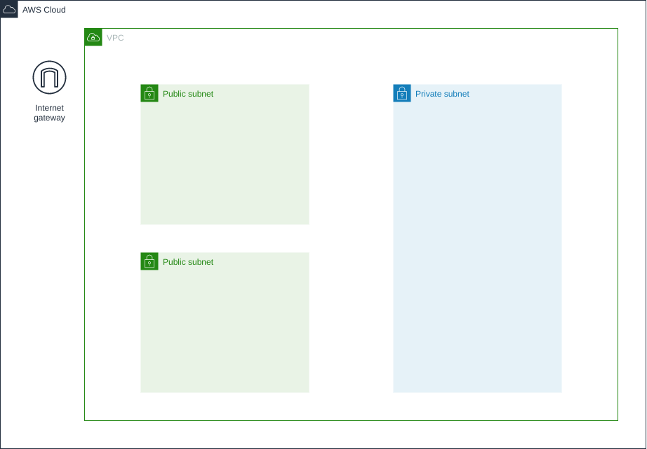
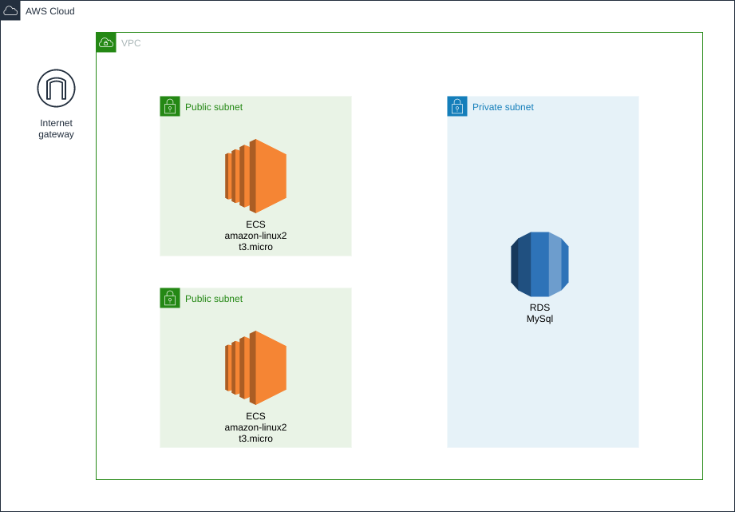
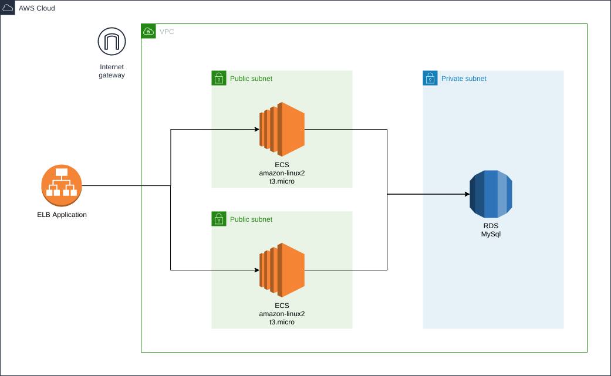

# DESAFIO AWS
Objetivo deste desafio é criar para o participante um ambiente muito similar a uma aplicação real.
Você enfrentará os desafios de cada passo.

## PARTE 0
Para iniciar voce deve criar uma api em sua linguagem de programação favorita, essa tem como objetivo cadastrar e consultar uma lista de contatos.
Abaixo você verá o detalhe esperado:
### Detalhes da API de contatos
- URL base /api/v1/contatos
- Consulta de contatos:
 - [GET] /api/v1/contatos
 - Resultado:
    ```json
    [
        {
            "id": 1,
            "nome": "Flipper",
            "telefone": "(99) 99999-9999"
        },
        {
            "id": 2,
            "nome": "Conrad",
            "telefone": "(99) 99999-9999"
        },
        {
            "id": 3,
            "nome": "Gordinho",
            "telefone": "(99) 99999-9999"
        }
    ]
    ```
- Cadastro de contatos:
 - [POST] /api/v1/contatos
 - Payload:
    ```json
    {        
        "nome": "Gordinho",
        "telefone": "(99) 99999-9999"
    }
    ```
- Lembre-se o foco deste desafio não é código e sim entendimento dos recursos e serviços da AWS, esse projeto é apenas uma base
- Você deverá persistir estes dados em base MySql, futuramente processada via AWS RDS
## PARTE 1

Nesta etapa você deve providenciar os seguintes recursos na AWS:
- Uma nova VPC
- 1 internet gateway
- 3 novas subnets, sendo 2 publicas e 1 privada
- 2 tabelas de rotas uma para subnet publica e ou para privada
- Certifique de garantir que uma subnet seja realmente privada
## PARTE 2

Nesta etapa você deve providenciar os seguintes recursos na AWS:
- 2 instancias EC2 com as seguintes caracteristicas:
 - Tipo = t3.micro
 - AMI = amazon linux 2
 - 1 KeyPair para acesso ssh
- 1 RDS com as seguintes caracteristicas:
 - Engine = MySQl
 - Versão = 8.0.32
 - Com MultiAZ desabilitado
 - Sem acesso publico
 - Tipo = db.t3.micro
 - Storage = 20gb
## PARTE 3

Nesta etapa você deve providenciar os seguintes recursos na AWS:
- Elastic Load Balance, com as seguintes caracteristicas
 - Schema = Internet Facing
 - IPV4
 - Alocado na az-a e az-c
 - Com security group default